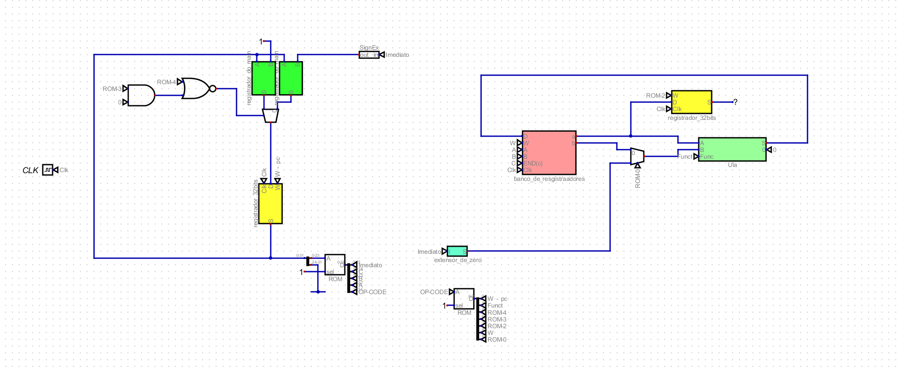
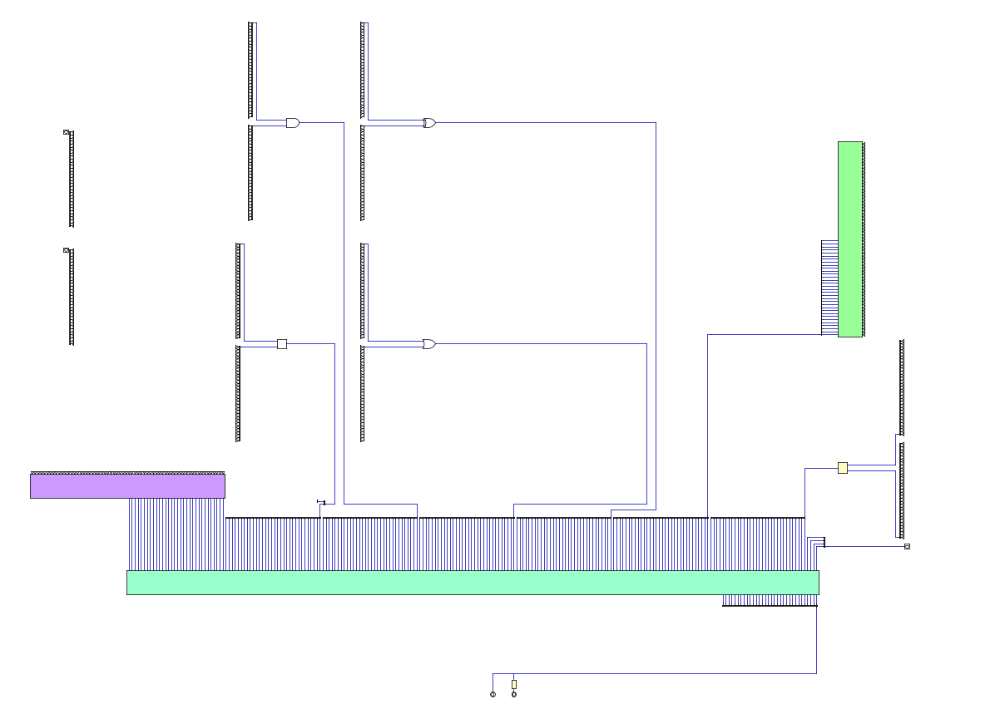
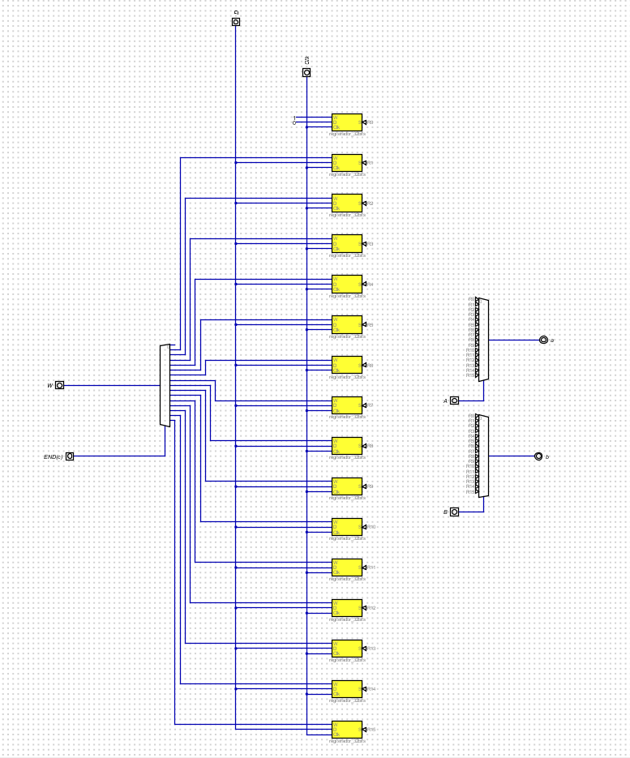
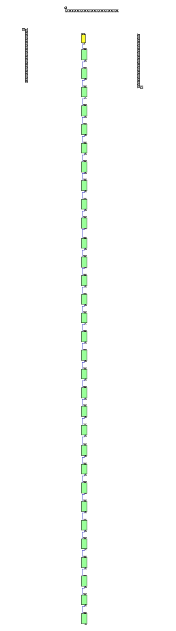
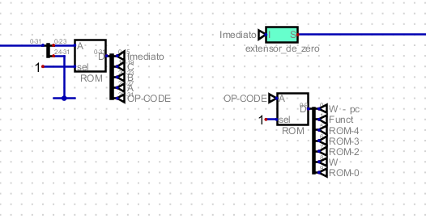

# Processador feito na matéria de Projetos Digitais. (Processor created as part of the Digital Projects course)
## Antonio da Ressurreição Filho, student in the second semester of Computer Science at the Federal University of Paraná (UFPR).
## Professor: Dr. Giovanni Venâncio. [site](https://www.inf.ufpr.br/giovanni/) 

### Português:

***Arquivo "TrabPD.pdf":***

Observa-se no arquivo "TrabPD.pdf" o enunciado do trabalho, criado pelo professor da Universidade Federal do Paraná Doutor Giovanni Venâncio. Esse arquivo foi utilizado como auxílio para que o trabalho fosse feito, em que é
possível observar nele a ideia principal contida no trabalho, a qual consiste basicamente na implementação de um processador inspirado na arquitetura MIPS.

***Arquivo "Codigo-C.c":***

Nota-se no arquivo "Codigo-C.c" o código na **linguagem C** feito pelo professor Doutor Giovanni Venâncio, o qual foi traduzido posteriormente para outra linguagem e foi utlizado nas memórias ROM do processador para que se façam
todas as operações, provando assim, que o processador e todos circuitos contidos nele funcionam perfeitamente.

***Arquivo "Relatório de Projetos.pdf":***

No arquivo "Relatório de Projetos.pdf" observa-se um pequeno relatório que fiz em relação às implementações que fiz durante o trabalho, mais detalhadamente sobre a minha Unidade Lógica Aritmética (ULA), a qual serve para fazer
as operações aritméticas, sobre meu Banco de Registradores e sobre meu programa principal. Ademais, nesse arquivo também tem a tradução do código C, criado pelo professor Doutor Giovanni Venâncio, para a linguagem **Assembly**,
para **binário** segundo a tabela dos OpCodes que eu criei em uma das minhas memórias ROM e para **Hexadecimal** segundo a mesma tabela citada anteriormente. 

***Pasta "imagens":***

Nessa pasta contém as imagens dos principais circuitos do meu programa principal do processador inspirado na arquitetura MIPS.

***Arquivo "trabalho_projetos.tgz":***

Esse arquivo, comprimido para .tgz, consiste nos arquivos do meu processador, os quais foram feitos no programa **Digital** e estão todos em formato .dig.

1. ***"Main.dig":*** Consiste no programa principal, onde basicamente todos os outros arquivos são executados simultaneamente e que consegue-se ver o funcionamento correto do processador inspirado na arquitetura MIPS.
   

2.  ***"Ula.dig":*** Consiste na minha Unidade Lógica Aritmética, onde faz-se as operações AND, OR, XOR, multplicação, adição, subtração e deslocamento entre dois números de 32 bits (A e B). Com meu multiplexador conectado a uma entrada
de 4 bits, em que cada número entre esses bits representa uma operação, conforme a seguir (detalhe importante: o bit mais significativo não é usado, somente está para fazer alusão correta à imagem do arquivo "TrabPD.pdf"):

- 0000 = Somador.
- 0001 = Subtrador.
- 0010 = Multiplicador.
- 0011 = And.
- 0100 = Or.
- 0101 = Xor.
- 0110 = Deslocador.

3. ***"banco_de_registradores.dig":*** Consiste no meu banco de registradores, no qual estão presentes 16 registradores de 32 bits cada, uma entrada "enable" W que consiste no botão de ativação do meu desmultiplexador que fica responsável por
escrever em um registrador escolhido. Além disso, há a entrada D, que estará ligada a todos os meus registradores e dirá o que será lido e repassado a saida "a" e a saída "b" através do banco de registradores. Há também, por fim, a entrada "Clk",
que consiste no Clock que é usado no programa principal.

4. ***"registrador_do_main.dig":*** Consiste basicamente no somador do meu PC, que está duplicado no meu programa principal porque terão opções do PC ir logo para a próxima linha (PC+1) ou dele pular e voltar linhas, através das operações de saltos
condicionais e incondicionais. Esses circuitos duplicados estão ligados no programa principal a um multiplexador que escolherá qual desses dois irá fazer a próxima operação, através dos códigos repassados na memória ROM.

5. ***Memórias ROM:*** Essas memórias são um dos circuitos mais importantes de todo o programa principal. Elas, juntas, fazem todo aquele código C que está no arquivo "Codigo-C.c" e depois traduzido para a linguagem de Assembly como mostrado no arquivo
"Relatório de Projetos.pdf" funcionar e organizam quais entradas devem ser ativadas nos multiplexadores do programa principal. Nelas, estão ligados a saída do PC e de 32 bits e o OP-CODE de 4 bits que sai de uma delas. É possível observar mais abaixo
o arquivo "Tabela-Memória ROM dos Mux.png", que consiste basicamente nas instruções dadas a memória ROM que divide o Imediato, o registrador que se escreve, os dois registradores que se leem e o OPCODE, que é baseado na memória ROM que liga os multiplexadores.

6. ***Outros arquivos:*** Os outros arquivos presentes nessa pasta são circuitos integrados que foram feitos com o intuitochegar nos circuitos acima mencionados. Lembrando: para que se veja todo o processador funcionando na plataforma ***"Digital"***, é
importante baixar todos os arquivos dessa pasta.

***Arquivo "Tabela-Memória ROM dos Mux.png":***

Como dito anteriormente, esse arquivo consiste na tabela usada para se fazer a memória ROM que manda as informações para o Imediato, para o registrador onde se escreve, para os 2 registradores onde se leem e para o OPCODE que é usado na outra memória ROM para
ativar e desativar os botões 1 e 0 dos multiplexadores do programa principal.

### English:

***File "TrabPD.pdf":***

In this document the project instructions created by Dr. Giovanni Venâncio, a professor at the Federal University of Paraná, are presented. This file was used as a reference to develop the project, outlining its main idea: the implementation of a processor inspired by the MIPS architecture.

***File "Codigo-C.c":***

The file "Codigo-C.c" contains a C language code created by Dr. Giovanni Venâncio, a professor at the Federal University of Paraná. This code was later translated into another language and used in the processor's ROM memory to perform all operations, thereby demonstrating that the processor and all its circuits function correctly.

***File "Relatório de Projetos.pdf":***

This file contains a brief report I created regarding the implementations made during the project, specifically detailing my Arithmetic Logic Unit (ALU), which performs arithmetic operations, my Register Bank, and my main program. Besides, this file includes the translation of the C code, originally created by Dr. Giovanni Venâncio, into Assembly, binary (based on the OpCode table I developed in one of my ROM memories), and hexadecimal (following the same table mentioned earlier).

***File "imagens":***

This folder contains images of the main circuits from the main program of the processor inspired by the MIPS architecture.

***File "trabalho_projetos.tgz":***

This compressed .tgz file contains all the processor files, which were created using the Digital software and are saved in the .dig format.

1. ***"Main.dig":*** This is the main program where all the other files are executed simultaneously. It allows us to visualize the correct functioning of the processor inspired by the MIPS architecture.
   

2. ***"Ula.dig":*** This file represents my Arithmetic Logic Unit (ALU), which performs AND, OR, XOR, multiplication, addition, subtraction, and shift operations between two 32-bit numbers (A and B). A multiplexer is connected to a 4-bit input, where each number represents a specific operation as follows (important detail: the most significant bit is unused, included only for proper alignment with the diagram in "TrabPD.pdf"):

- 0000 = Adder.
- 0001 = Subtractor.
- 0010 = Multiplier.
- 0011 = And.
- 0100 = Or.
- 0101 = Xor.
- 0110 = Shifter.

3. ***"banco_de_registradores.dig":*** This file contains my Register Bank, which includes 16 32-bit registers. It has an "enable" input, W, which acts as the activation button for the demultiplexer responsible for writing to the selected register. There is also an input D, connected to all registers, which specifies what will be read and forwarded to outputs A and B via the Register Bank. Additionally, there is a Clk input, which serves as the clock signal used in the main program.
 

4. ***"registrador_do_main.dig":*** This file essentially represents the adder for the Program Counter (PC), duplicated in the main program. These duplications allow the PC to either move to the next line (PC+1) or jump backward or forward based on conditional and unconditional jump operations. These duplicated circuits are connected in the main program to a multiplexer, which determines which one will execute the next operation based on the codes passed through the ROM memory.

5. **ROM memories:*** These memories are among the most crucial circuits in the entire main program. Together, they execute the C code found in the file "Codigo-C.c," which was translated into Assembly language and detailed in "Relatório de Projetos.pdf." The ROMs organize which inputs need to be activated in the multiplexers of the main program. They are connected to the PC's 32-bit output and to a 4-bit OP-CODE that comes from one of them. Below, you can see the file "Tabela-Memória ROM dos Mux.png," which essentially shows the instructions used in the ROM memory to divide the Immediate value, the register to write to, the two registers to read from, and the OP-CODE based on the ROM memory controlling the multiplexers.

6. ***Other files:*** The other files in this folder are integrated circuits that were designed to create the circuits mentioned above. Important note: To view the entire processor functioning correctly on the "Digital" platform, it is necessary to download all the files in this folder.

***File "Tabela-Memória ROM dos Mux.png":***

As previously mentioned, this file contains the table used to design the ROM memory. This memory sends instructions to the Immediate value, the register to write to, the two registers to read from, and the OP-CODE, which is used in another ROM memory to activate or deactivate the 1 and 0 buttons of the multiplexers in the main program.

